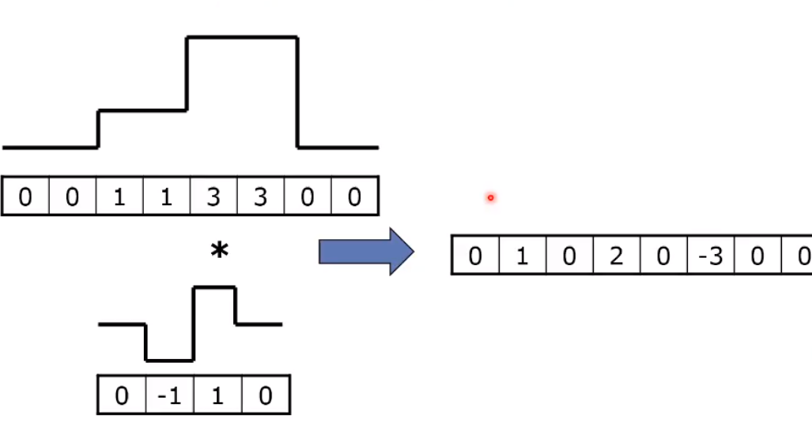

# Objekterkennung

Objekte koennen duch das detektieren von kanten
erkennt werden.
Kanten sind spruenge in der Bildintensitaet.
Diese spruenge koennen auch wenig unterschied haben
(schraeg sein).

Kantenerkennung:

- Ableitung der Intensitaet (Sobel)
- Filter

## Kantenerkennung durch Ableitung

Erkennung durch die Differenz zwerier nachbarpixel:

## Canny Filter

**1 Kanten detektieren**

-> Erste ableitung einer Gauss Funktion

In 2D 1. Ableitung einer Gauss Funktion in X und eine Gauss Funktion in Y
Um alle kanten zu finden muss man acht verschieden gedrehte Filter
anwenden ... auf jeden pixel.

Indem man zuerst Filtert (Gaus, verminderung des Rauschens) und dann
Ableitet (Kanten detektieren).

**Sobel Filter:** Nur groesse 3x3

**2 Kante**

Meistens will man nur eine 1px grosse kante, da nimmt man
das maximum senkrecht zur kante.

**3 Zusammenhang finden**

Pixel zwischen T_high und T_low werden nur dann als Kante
markiert wenn sie irgendwann mit T_high verbunden sind.

