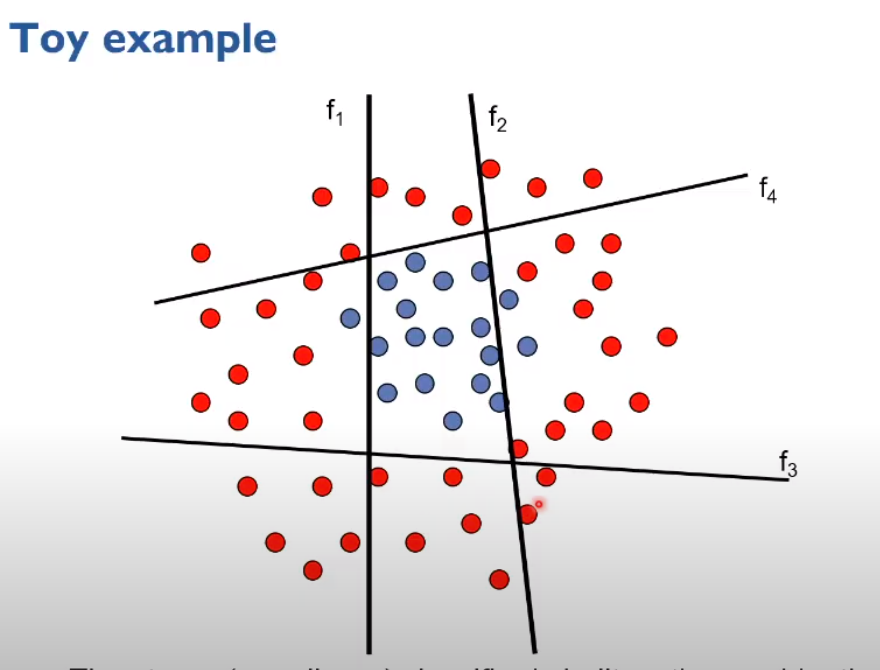

# Face Detection

Viola-Jones Face detektor

Problem: Möglichst viele Positionen auswerten an welchen ein Gesicht sein kann.

Idee:

 - Einfache Features erkennen
 - Lernen welche Features relevant sind

Features werden gebraucht da aus den Pixeln selber keine wirkliche
Information gelesen werden koennen. Die Features werden häufig mit Filtern
erkennt. Filter sind jedoch recht aufwendig zu berechnen.
Beim Viola-Jones Filter werden sehr einfache Filter verwendet.

Die Filter werden danach nicht berechnet sondern auf dem Integral Image
nachgeschaut. Damit nicht alle Features berechnet werden müssen,
werden mit Adaboost die wichtigsten Features herausgesucht um
ein Gesicht zu erkennen.

Dieser Boost funktioniert indem alle Filter angeschaut werden
und danach ausgewertet. Falsche resultate werden höher gewichtet
als richtige. Bis das resultat aus den besten Klassifizierungen
bestimmt wurde.

Die bestimmten Filter werden danach mit dem sliding window
prinzip auf dem ganzen Bild angewendet.

Ziel:

Hohe True-Poitive rate, richtige gesichter sollen gefunden werden.
Tiefe False-Positive rate, dinge die kein gesicht sind nicht als gesicht anzeigen.

Um das ganze zu beschläunigen wird ein Cascade Approach angewendet,
das heisst alle negativen ergebnisse werden sofort aussortiert.
